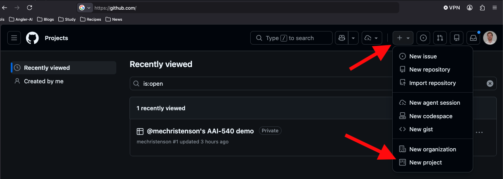
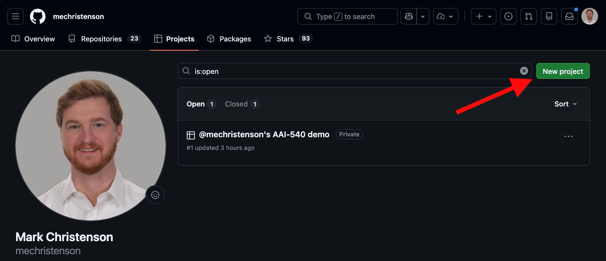
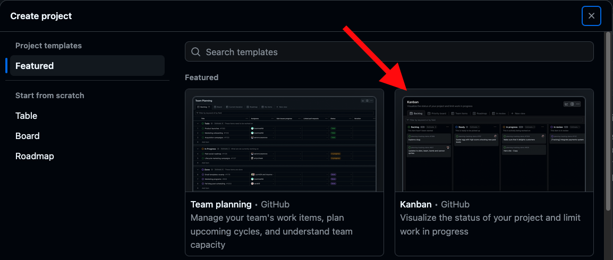
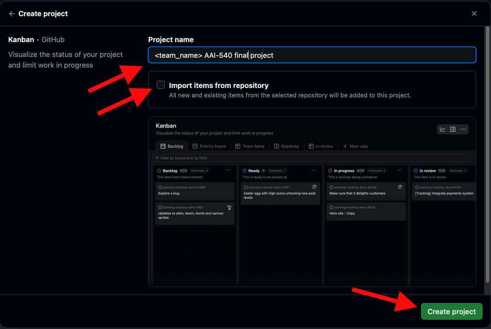
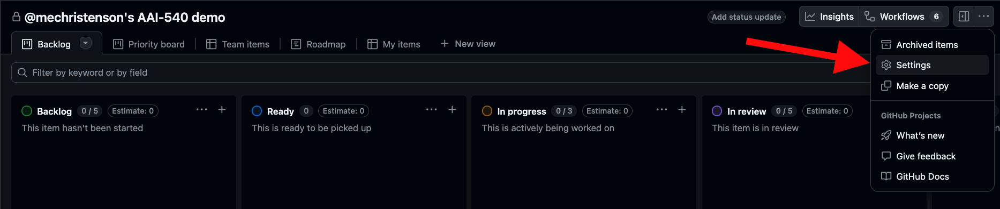
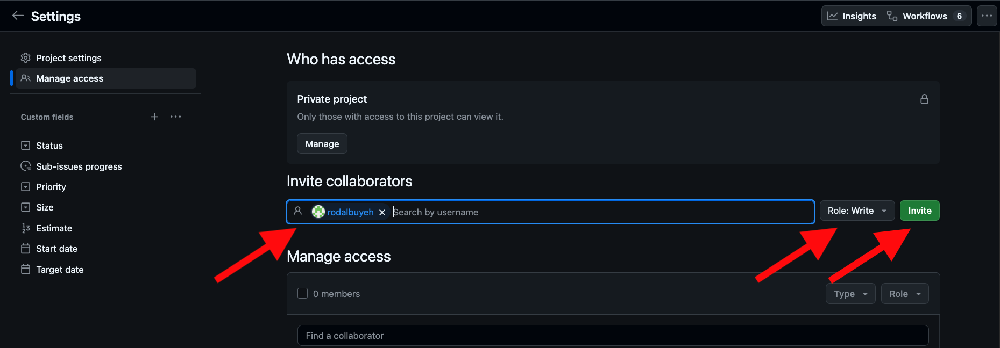
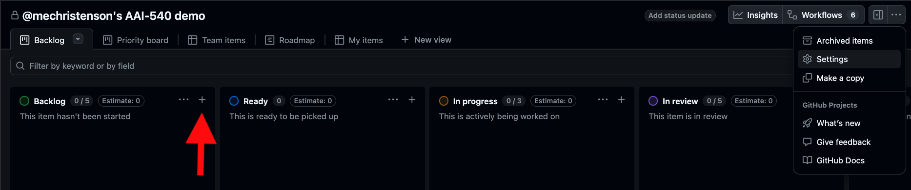
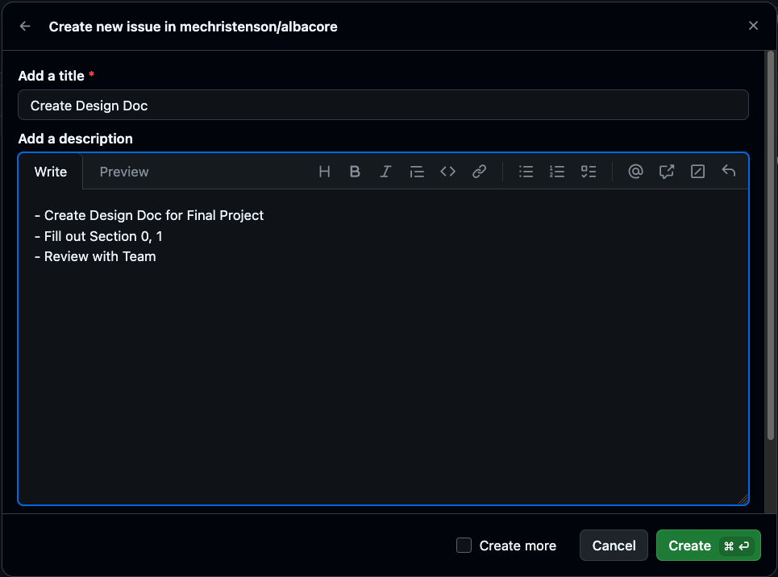
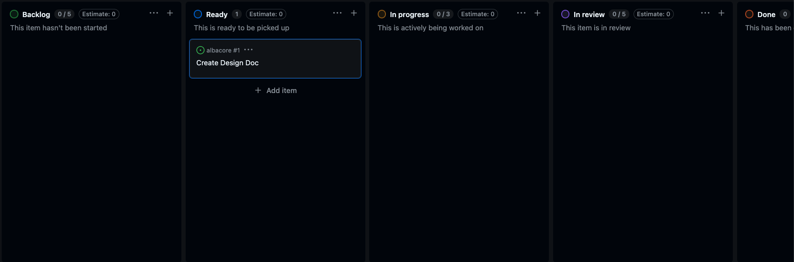

# Project Management

Solid project management is vital to machine learning operations and collaboration. For the team project, each team should use a Github Project board to track their project and support genuine collaborations toward project goals. It is more important to organize, define, and assign tasks than for one team member to execute all tasks to meet recommended project steps for the module. Use the Github Project board to facilitate teammate inputs and outputs for your ML project across the span of the team project.

## Kanban

Kanban is a visual workflow method that organizes work into columns representing stages (e.g., **To Do**, **In Progress**, **Done**). Tasks move across the board as they progress, giving the team a clear, shared view of what's being worked on and what's blocked. For your final project, use it to track deliverables, divide work among teammates, and surface bottlenecks early.

## Usage

Every week your team should sync on what tasks are in each column, who is working on what, and if any tasks are blocked. This will help ensure everyone is aligned and can support each other to meet project milestones. For your weekly team status updates, include a snapshot of your project board to show progress.

## Enter/Exit Criteria

In your first meeting, your team should set entry/exit criteria for each column. The following is my recommendation for entry criteria for each column, but your team can customize these based on your workflow and project needs:
- **Backlog**: Tasks that are identified but not yet started. Entry criteria: Task is defined by a team member and they generate a title and description for the task.
- **To Do**: Tasks that are ready to be worked on. Entry criteria: Task has been reviewed with the team. It has a clear "definition of done", it is assigned to a team member, and it has an estimated effort.
- **In Progress**: Tasks that are currently being worked on. Entry criteria: Task has been moved from "To Do" to "In Progress" by the assigned team member.
- **In Review**: Tasks that are completed but need to be reviewed by teammates. Entry criteria: Task is "dev complete". Task has all code and documentation, and it has been tested by the developer as required by the implementation details in the ticket.
- **Done**: Tasks that are completed and have been reviewed by a designated teammate (Not the task owner).

---

## Setting Up Github Projects

### Step 1

- Navigate to github.com in your browser and log in to your account. Click on the "+" icon in the top right corner and select "New project" from the dropdown menu.

### Step 2

- On your profile page, select "New Project" to create a new project board.

### Step 3

- Choose the "Kanban" template to set up a project board with columns for "To Do," "In Progress," and "Done."

### Step 4

- Name your project after your final project topic.
- Uncheck "Import items from repository" to start with a blank board.
- Click "Create project".

### Step 5

- On your project page, click "Settings" to add your teammates to the project board.

### Step 6

- Select "Manage access" on the left sidebar, then enter your teammates' GitHub usernames in the "Invite collaborators" field.
- Grant your teammates "Write" access, and click "Invite" to invite them to the project.

### Step 7

- To add a new task, click the "+" button in the "Backlog" column.

### Step 8

- In the task creation form, enter a title and description for the task. You should also define a definition of done, e.g. "Configure CPU Monitor for "Final Project" Model Endpoint, share notebook to implement monitor with team for review". Click "Create" to add the task to the "Backlog" column.

### Step 9

- Once a task is created, you can click on the task card to open its details. Your team should sync as needed to move cards across the columns as work progresses. You should also sync on developers and reviewers for each task.

